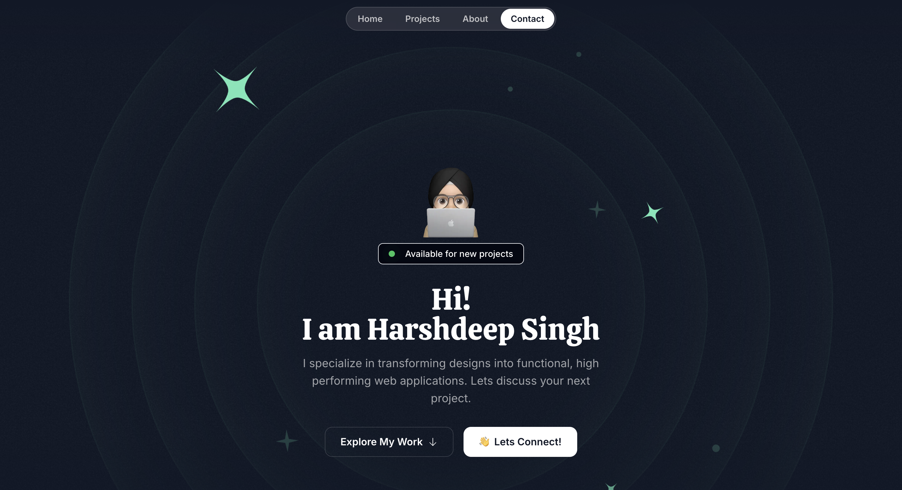

# My Portfolio

This repository hosts the code for my personal portfolio website, which showcases my projects, skills, and experiences in software engineering and electronics. The website is built for fast performance, responsiveness, and an engaging user experience.



## 🚀 Live Site

Visit the portfolio: [https://portfolio-harshdeepsingh.vercel.app](https://portfolio-harshdeepsingh.vercel.app)

## 🛠️ Tech Stack

- **Next.js**: Framework for optimized, server-rendered pages.
- **Tailwind CSS**: Utility-first CSS for responsive styling.
- **Framer Motion**: Smooth animations and interactive elements.
- **Vercel**: Deployment platform for seamless hosting.

## 📂 Structure

- `components/`: Reusable UI components.
- `pages/`: Site pages and routing.
- `public/`: Static assets, like images.
- `styles/`: Tailwind CSS configurations and global styles.

## 📦 Installation

1. **Clone the repository**
   ```bash
   git clone https://github.com/Harshdeepsingh0311/Portfolio.git
   ```
2. **Navigate to the project folder**
   ```bash
   cd Portfolio
   ```
3. **Install dependencies**
   ```bash
   npm install
   ```
4. **Run the development server**
   ```bash
   npm run dev
   ```
   Open [http://localhost:3000](http://localhost:3000) to view the site locally.

## 📄 License

This project is open-sourced under the MIT License—feel free to explore, use, and modify!
